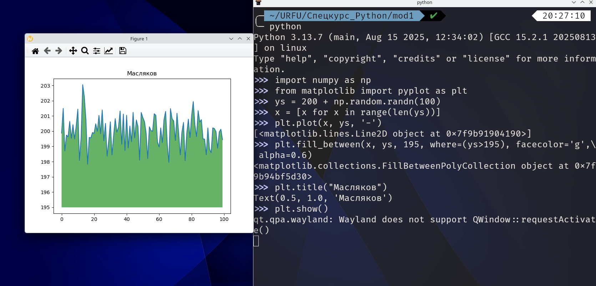
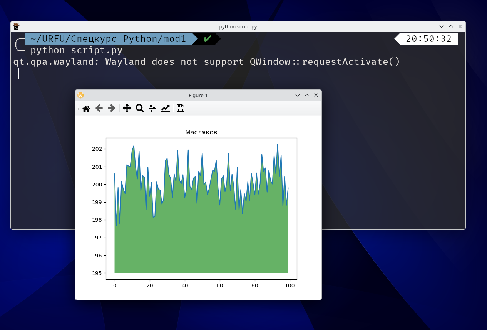
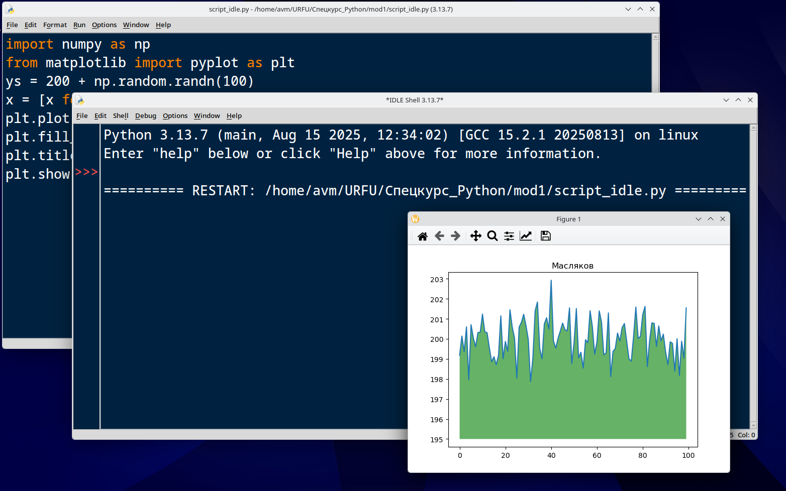
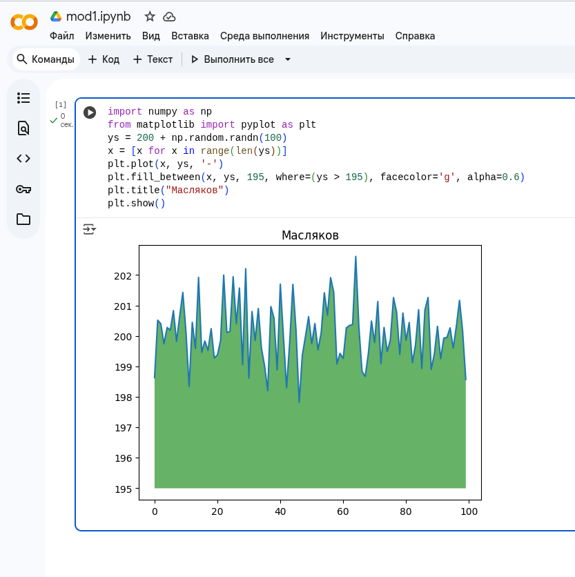
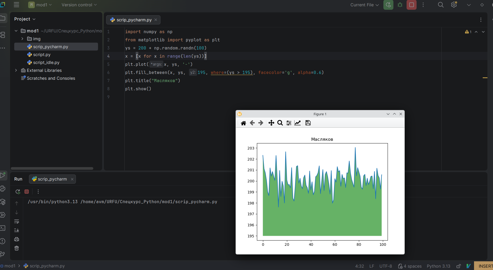

# ДЗ №1

```python
import numpy as np
from matplotlib import pyplot as plt
ys = 200 + np.random.randn(100)
x = [x for x in range(len(ys))]
plt.plot(x, ys, '-')
plt.fill_between(x, ys, 195, where=(ys > 195), facecolor='g', alpha=0.6)
plt.title("Масляков")
plt.show()
```
1. Интерактивный режим (командный интерпретатор python)
   
   

2. Скриптом из командной строки 
   
   

3. IDLE
   
   

4. Google.Collab
   
   

5. PyCharm
   
   

6. Visual Studio code
   
   


